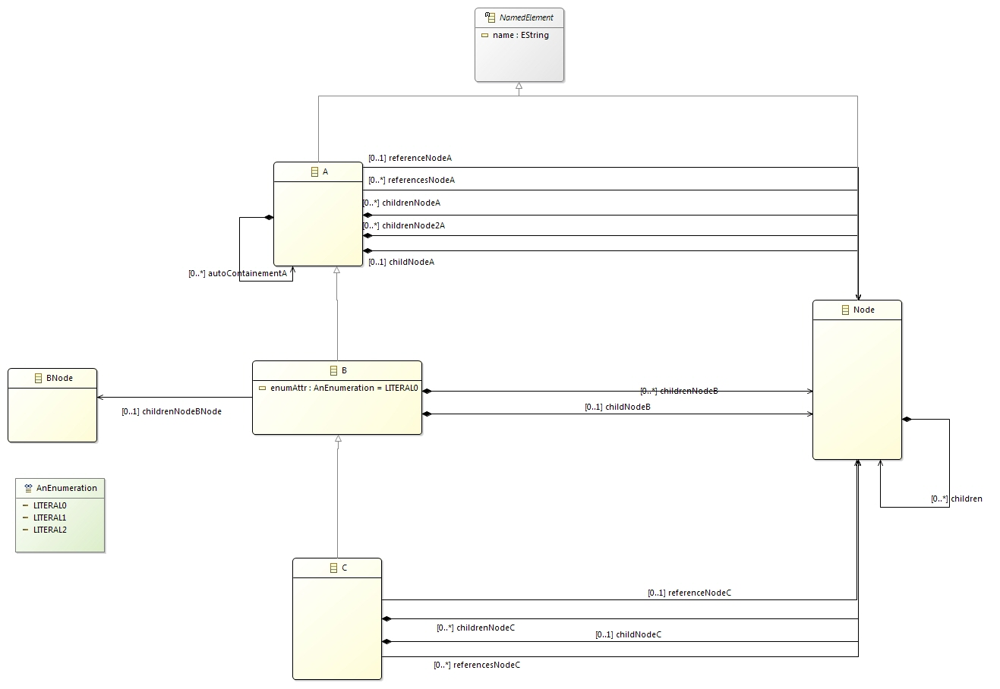

# BOEM

_**B**uilder **O**f **E**MF **M**odels_ 

The aim of the BOEM library is to provide an API that eases the creation of EMF Model using XTend syntax. Using such syntax helps to:
 * Speed up the creation of tests
 * Improve the readability of the tests
 * Improve maintainability when the tested metamodel changes
 * Ease the creation of inter-connected models

It has been created and used in industrial project to ease the creation input for JUnit tests on the metamodel and business rules.

## Installation

Install the feature BOEM Feature (fr.ibp.odv.boem.feature) from one of the following update site:

[Update site 1.0.0](TODO "Update site 1.0.0")  
[Update site HEAD](TODO "Update site HEAD") 

## Usage

### How to start
Create a BOEM factory

```xtend
extension BoemFactory factory = new BoemFactory(YourMM.eINSTANCE)
```

_Use the keyword extension in order to use all public methods from the BOEM factory anywhere in your class_

Import static APIs

```xtend
import static extension fr.ibp.odv.boem.lib.Boems.*
```

### Examples
All the examples use the following metamodel:


#### How to create an element
```xtend
// Simple creation
val model = A.build [
  name = "AName"
].buildTree
```


#### How to add children
```xtend
val model = A.build [
  name = "AName";

  // Single valued containment feature
  childNodeA = Node.build [
    name = "SingleChildName"
  ]

  // Adds one child
  childrenNodeA += Node.build [
    name = "ANodeName0"
  ]

  // Adds several children at once
  childrenNodeA += #[
    Node.build [
      name = "ANodeName1"
    ],
    Node.build [
      name = "ANodeName2"
    ]
  ]
].buildTree
```

#### How to add pointers to created objects

```xtend
val model = B.build [
  name = "AName"

  // Adds one child with reference
    childrenNodeA += "id0" >> Node.build [
      name = "ANodeName0"
  ]
  // Adds several children at once with references
  childrenNodeA += #[
    "id1" >> Node.build [
      name = "ANodeName1"
    ],
    "id2" >> Node.build [
      name = "ANodeName2"
    ]
  ]

  // Adds several children at once with references
  childrenNodeB += #[
    "id3" >> Node.build [
      name = "ANodeName3"
    ],
    "id4" >> Node.build [
      name = "ANodeName4"
    ]
  ]
].buildTree

// Accessing node
assertEquals("ANodeName0", model.access(Node, "id0").name)
assertEquals("ANodeName1", model.access(Node, "id1").name)
assertEquals("ANodeName2", model.access(Node, "id2").name)

assertEquals(2, model.root.childrenNodeB.size)
assertEquals("ANodeName3", model.access(Node, "id3").name)
assertEquals("ANodeName4", model.access(Node, "id4").name)
```

You can even register an id provider against the BoemFactory. It will compute an id for each element (at build time) using your rules. For example:
 
```xtend
extension BoemFactory factory = new BoemFactory(BoemTestPackage.eINSTANCE).registerIdProvider([
  if (it instanceof NamedElement) {
    return it.name
  }
  return null
])

//...

val model = B.build [
  name = "AName"
  // Adds one child with reference
  childrenNodeA += Node.build [
    name = "ANodeName0"
  ]
  // Adds several children at once with references
  childrenNodeA += #[
    Node.build [
      name = "ANodeName1"
    ],
    Node.build [
      name = "ANodeName2"
    ]
  ]

  // Adds several children at once with references
  childrenNodeB += #[
    Node.build [
      name = "ANodeName3"
    ],
    Node.build [
      name = "ANodeName4"
    ]
  ]
].buildTree

// Accessing node
assertEquals("ANodeName0", model.access(Node, "ANodeName0").name)
assertEquals("ANodeName1", model.access(Node, "ANodeName1").name)
assertEquals("ANodeName2", model.access(Node, "ANodeName2").name)

assertEquals(2, model.root.childrenNodeB.size)
assertEquals("ANodeName3", model.access(Node, "ANodeName3").name)
assertEquals("ANodeName4", model.access(Node, "ANodeName4").name)
```

You can also use a shorter syntax to access your elements

```xtend
val model = A.build [
  name = "AName"
  childrenNodeA += "id1" >> Node.build [
    name = "ANode"
  ]
].buildTree

val target = model.access(Node, "id1");
val target2 = ("id1" => model) as Node
assertTrue(target2 == target)
val target3 = model.access("id1")
assertTrue(target3 == target)
assertTrue(target == "id1" => model)
```

#### How to create references
```xtend
val it = A.build [
  name = "AName"
  autoContainementA += "id0" >> B.build [
    referenceNodeA = Node.buildRef("id1")
  ]
  childrenNodeA += "id1" >> Node.build [
    name = "ANode"
  ]
].buildTree
```

or with a shorter syntax

```xtend
val it = A.build [
  name = "AName"
  autoContainementA += "id0" >> B.build [
    referenceNodeA = Node << "id1"
  ]
  childrenNodeA += "id1" >> Node.build [
    name = "ANode"
  ]
].buildTree
```

#### How to update an element
```xtend
val model = A.build [
  autoContainementA += "B" >> B.build [
    autoContainementA += "D" >> C.build
  ]
].buildTree

assertEquals(null, model.root.name)
assertEquals(null, model.access(NamedElement, "B").name)
assertEquals(null, model.access(A, "C").name)

model.update [
  name = "NameA"
  autoContainementA.get(0).with [
    name = "NameB"
    autoContainementA.get(0).with [
      name = "NameD"
    ]
  ]
]

assertEquals("NameA", model.root.name)
assertEquals("NameB", model.access(B, "B").name)
assertEquals("NameC", model.access(C, "C").name)

model.access(B, "B").name = "NameB2"
model.access(C, "C").name = "NameB2"

assertEquals("NameB2", model.access(B, "B").name)
assertEquals("NameC2", model.access(C, "C").name)
```

## Contributing
1. Fork it!
2. Create your feature branch: `git checkout -b my-new-feature`
3. Commit your changes: `git commit -am 'Add some feature'`
4. Push to the branch: `git push origin my-new-feature`
5. Submit a pull request :smiley:

## License
[Eclipse Public License - v 1.0](https://www.eclipse.org/legal/epl-v10.html)  
[Contribution guidelines for this project](docs/CONTRIBUTING.md)
